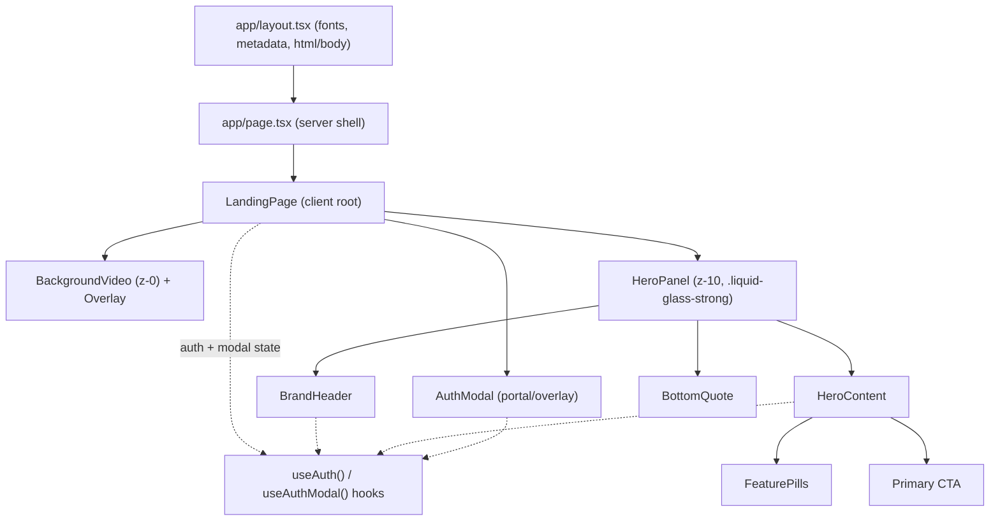
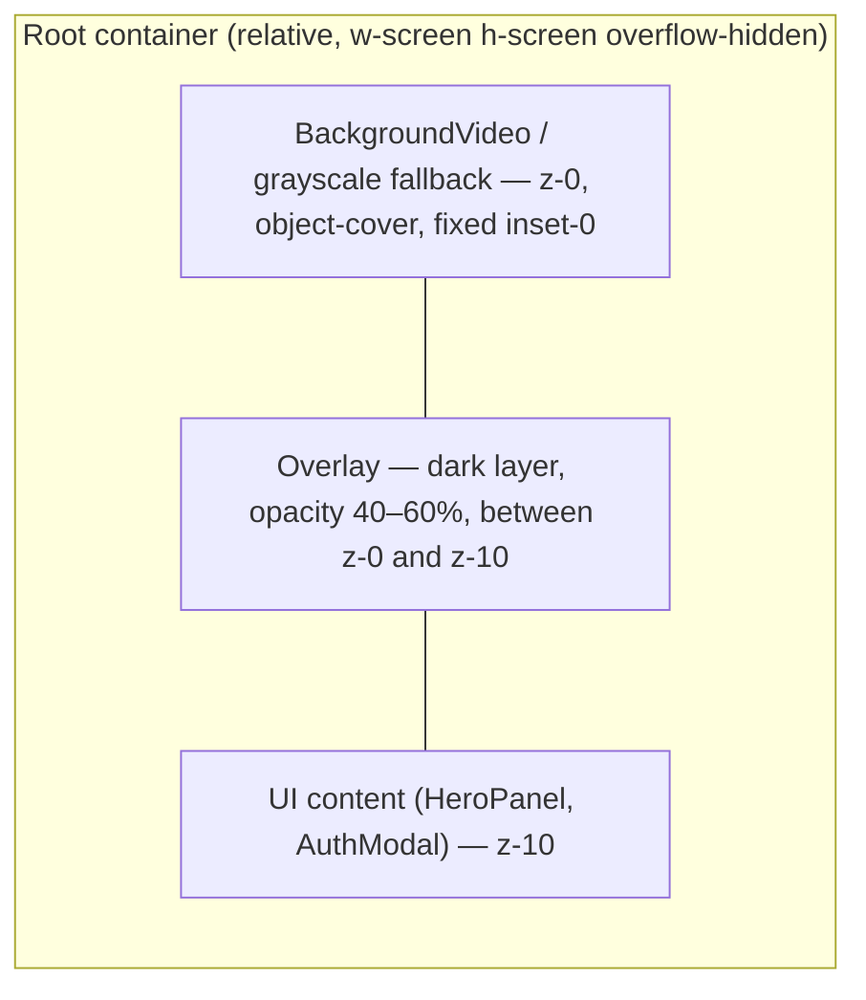
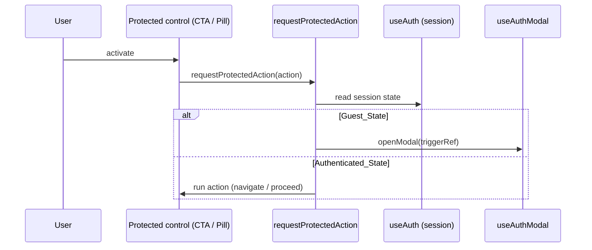

# Design Document

## Overview

MediScan AI's landing page is a single-route, login-first hero experience built on Next.js (App Router) with TypeScript, Tailwind CSS, Framer Motion, and lucide-react. The page renders a full-viewport looping background video, a darkening overlay, and one centered "liquid glass" hero panel that holds all primary content. Guests are gated: any attempt to use a platform feature opens an authentication modal rather than navigating into the product.

The design is intentionally layered into three concerns that map cleanly onto the requirements:

1. **Visual system** — a strict grayscale palette, the `.liquid-glass` / `.liquid-glass-strong` CSS component layer, and a Poppins + Source Serif 4 typography setup.
2. **Layout & composition** — a fixed three-layer z-stack (video `z-0`, overlay between, UI `z-10`) with a responsive hero panel that reflows on mobile.
3. **Interaction & state** — a minimal client-side auth/session model (`Guest_State` vs `Authenticated_State`), protected-action gating, modal focus management, and reduced-motion-aware animation.

Because the bulk of this feature is presentational (CSS, layout, animation, video), most acceptance criteria are validated with snapshot, example, and integration-style component tests. A small but important core of **pure logic** — user-identity resolution/truncation, protected-action gating, and grayscale color validation — is suitable for property-based testing and is captured in the Correctness Properties section.

### Design Goals

- Keep all rendering deterministic and testable by isolating pure logic (identity resolution, gating decisions, color validation) from React components.
- Make the liquid glass aesthetic a reusable CSS contract, not per-component styling.
- Degrade gracefully: video failure → grayscale fallback; font failure → system fallback; missing logo → text fallback; `prefers-reduced-motion` → static presentation.
- Preserve accessibility as a first-class concern (semantic structure, ARIA labels, focus trap, Escape-to-close, focus restoration).

### Technology Decisions

| Concern | Choice | Rationale |
|---|---|---|
| Framework | Next.js App Router + TypeScript | Required by spec; server components for static shell, client components for interactivity. |
| Styling | Tailwind CSS + `@layer components` | Required; utility classes for layout, custom component layer for the glass system. |
| Animation | Framer Motion | Required; declarative motion with `useReducedMotion` support built in. |
| Icons | lucide-react | Required; consistent stroke-based icon set. |
| Fonts | `next/font/google` (Poppins, Source Serif 4) | Built-in font optimization, automatic fallback metrics, and `display: swap`. |

## Architecture

### Rendering Model

The page uses a thin server component shell (`app/page.tsx`) that renders a single client component (`LandingPage`). All interactivity (auth state, modal, animations) lives in client components. This keeps the initial HTML payload small (supporting Requirement 16's "prioritize initial UI content") while allowing rich client interaction.



### Z-Stack and Layout Layers

Requirement 1 fixes the stacking contract. The root container is a full-viewport relative element with three stacked layers:



- `z-0`: `BackgroundVideo` (or grayscale fallback `div`), absolutely positioned to cover the viewport with `object-cover`.
- Overlay: an absolutely positioned `div` with a grayscale tint at 40–60% opacity, sitting visually between video and UI (rendered after video, before UI, or with an intermediate z-index such as `z-[5]`).
- `z-10`: the centered `HeroPanel`. The `AuthModal`, when open, renders above everything at a higher z-index (e.g. `z-50`).

### State Architecture

Auth and modal state are client-only and intentionally lightweight. Backend authentication is out of scope, so the design models session state as an in-memory (optionally `sessionStorage`-backed) value plus a modal controller. Two small hooks encapsulate this:

- `useAuth()` → `{ session, signIn, signInWithGoogle, signOut }` where `session` is `Guest_State` or `Authenticated_State`.
- `useAuthModal()` → `{ isOpen, openModal, closeModal, triggerRef }` managing open state and the element that opened the modal (for focus restoration per Requirement 10.10 / 15.x).

A `ProtectedActionContext` exposes a single `requestProtectedAction(action)` function used by the CTA, feature pills, and any dashboard-bound control. This centralizes the gating decision (Requirement 9) so every protected control behaves identically.



### Project Structure

```
app/
  layout.tsx                # html/body, font setup (Poppins + Source Serif 4), metadata
  page.tsx                  # server shell, renders <LandingPage/>
  globals.css               # Tailwind directives, grayscale CSS vars, @layer components glass system
components/
  landing/
    LandingPage.tsx         # client root: composes layers + providers
    BackgroundVideo.tsx     # video element, autoplay/loop/mute, error+timeout fallback
    Overlay.tsx             # dark grayscale overlay
    HeroPanel.tsx           # centered glass card, responsive sizing, entrance animation
    BrandHeader.tsx         # logo, name, menu control, user identity area
    HeroContent.tsx         # headline, supporting text, primary CTA
    FeaturePills.tsx        # three glass pills with glow hover/focus
    BottomQuote.tsx         # label, quote, author line
    AuthModal.tsx           # modal: inputs, continue button, Google button, focus trap
hooks/
  useAuth.ts                # session state (guest/authenticated)
  useAuthModal.ts           # modal open/close + focus restoration
  useProtectedAction.ts     # gating decision wrapper
lib/
  identity.ts               # resolveUserIdentity, truncateIdentifier (pure)
  gating.ts                 # decideProtectedAction (pure)
  color.ts                  # grayscale validation helpers (pure)
  fonts.ts                  # next/font configuration
  config.ts                 # constants: video URL, palette, copy strings
public/
  logo.png                  # medical logo
```

### Animation Strategy

- Framer Motion drives entrance and hover motion (Requirement 12.3).
- Entrance: `HeroPanel` and its children fade + float in using a staggered `variants` set, deferred so the static content paints first (Requirement 16.1). A subtle continuous float uses an infinite `y` keyframe animation.
- Hover/active: buttons and cards use `whileHover={{ scale }}` and `whileTap` for active state (Requirements 7.7–7.9, 8.3, 12.2).
- Reduced motion: a single `useReducedMotion()` read (Framer Motion) gates all non-essential motion. When reduced motion is on, entrance variants resolve to their final static state, the infinite float is disabled, and hover scale transitions are suppressed (Requirement 12.5). Video autoplay/loop is considered essential ambiance and continues, but no UI motion is applied.

### Performance Strategy

- The video uses `preload="auto"` with `playsInline`, `muted`, `loop`, and `autoPlay`. A `poster` (grayscale frame or palette color) prevents a black flash before first frame.
- Animation work is deferred via Framer Motion's mount lifecycle and `transition` delays so the first paint is static content (Requirement 16.1).
- Transitions use transform/opacity only (GPU-friendly) to target 60fps (Requirements 12.4, 16.3).
- Fonts use `next/font` with `display: swap` so text renders immediately in a fallback face and swaps when the web font loads (Requirements 3.7, 3.8).

## Components and Interfaces

### `LandingPage` (client root)
Composes the three z-layers and provides the auth/modal/gating context. Holds no presentational logic itself.

```typescript
function LandingPage(): JSX.Element;
```

Responsibilities:
- Render `BackgroundVideo` (z-0), `Overlay`, `HeroPanel` (z-10), and conditionally `AuthModal`.
- Provide `AuthProvider` / `ProtectedActionProvider` context.

### `BackgroundVideo`
Full-viewport looping video with timeout + error fallback.

```typescript
interface BackgroundVideoProps {
  src: string;            // CloudFront URL from config
  fallbackColorVar: string; // grayscale CSS var for fallback
  loadTimeoutMs?: number; // default 5000
}

type VideoStatus = "loading" | "playing" | "failed";
```

Behavior:
- On mount, start a 5s timer (Requirement 1.9). Clear it on `canplay`/`playing`.
- On `error` or timeout, set status `failed` and render a solid grayscale `div` instead, keeping the overlay and z-10 content intact (Requirements 1.9, 1.10).
- Attributes: `autoPlay muted loop playsInline preload="auto"` with `object-cover` and `inset-0` (Requirements 1.1–1.6, 1.8).

### `Overlay`
Stateless dark grayscale layer at 40–60% opacity positioned between video and UI (Requirement 1.7). Pure presentational.

### `HeroPanel`
Centered glass card; responsive width 68–72% at ≥768px, vertical stacking and reduced padding below 768px (Requirements 5.2–5.8).

```typescript
interface HeroPanelProps {
  children: React.ReactNode;
}
```

- Applies `.liquid-glass-strong`, `rounded-[3rem]`, entrance/float motion (reduced-motion aware).

### `BrandHeader`
Logo, platform name, menu control, and user identity area.

```typescript
interface BrandHeaderProps {
  session: Session;        // determines identity text
  onMenuActivate: () => void;
}
```

- Renders `/logo.png` with an `onError` fallback to the "MediScan AI" text (Requirements 6.1, 6.6).
- Identity area derives its text from `resolveUserIdentity(session)` (Requirements 6.4, 6.5, 6.7).
- Menu control is a glass pill button with the lucide `Menu` icon and a visible pressed/focus state (Requirements 6.3, 6.8).

### `HeroContent`
Headline (with serif-italic emphasis), supporting text, and the primary CTA.

```typescript
interface HeroContentProps {
  onPrimaryAction: () => void; // routed through requestProtectedAction
}
```

- Headline split so emphasized words use Source Serif 4 italic (Requirements 7.1–7.3, 3.5).
- Supporting text in `text-white/70`, `max-w-xl`, relaxed leading (Requirement 7.4).
- Primary CTA: `.liquid-glass-strong`, fully rounded, contains one lucide icon (`ArrowRight` or `Sparkles`) inside a `w-8 h-8 rounded-full bg-white/15` circular container; hover/active/leave transitions ≤300ms (Requirements 7.5–7.10, 13.2).

### `FeaturePills`
Three glass pills.

```typescript
interface FeaturePillsProps {
  pills?: readonly string[]; // defaults to the three required labels in order
  onActivate: (label: string) => void; // protected action
}
```

- `.liquid-glass`, fully rounded, `text-xs`, `text-white/80`; glow on hover AND focus (Requirements 8.1–8.5).

### `BottomQuote`
Label, mixed Poppins/serif-italic quote, author line with decorative rules (Requirement 11).

### `AuthModal`
Cinematic modal with focus management.

```typescript
interface AuthModalProps {
  isOpen: boolean;
  onClose: () => void;          // restores focus to trigger
  onEmailSubmit: (email: string, password: string) => void;
  onGoogleSignIn: () => void;
}
```

Behavior:
- `.liquid-glass-strong`, `rounded-[2rem]`; fade + scale entrance over a backdrop-blurred overlay (Requirements 10.1, 10.2).
- Title/subtitle, borderless glass email + password inputs with glowing focus, "Continue Securely" button, "OR" divider, "Continue with Google" button with white Google icon and scale hover (Requirements 10.3–10.9).
- Focus trap confining Tab focus to modal elements; focus moves to the first interactive element on open; Escape closes; close returns focus to the opener (Requirements 10.10, 15.3–15.5).

### Pure Logic Modules

```typescript
// lib/identity.ts
type Session =
  | { kind: "guest" }
  | { kind: "authenticated"; identifier: string | null };

const GUEST_LABEL = "Guest User";
const MAX_IDENTIFIER_LENGTH = 32;

function truncateIdentifier(id: string, max = MAX_IDENTIFIER_LENGTH): string;
function resolveUserIdentity(session: Session): string;

// lib/gating.ts
type GatingDecision = { type: "open-modal" } | { type: "proceed" };
function decideProtectedAction(session: Session): GatingDecision;

// lib/color.ts
function hslSaturation(color: string): number; // parses hsl()/hex/rgb → saturation %
function isGrayscale(color: string): boolean;   // saturation === 0
```

## Data Models

### Session

```typescript
type Session =
  | { kind: "guest" }
  | { kind: "authenticated"; identifier: string | null };
```

`identifier` is typically an email/display name supplied by a future auth backend. `null` models the "authenticated but no identifier available" case (Requirement 6.7).

### Modal State

```typescript
interface AuthModalState {
  isOpen: boolean;
  triggerEl: HTMLElement | null; // element to restore focus to on close
}
```

### Grayscale Palette (config)

```typescript
// HSL tiers required by Requirement 2.1 (all saturation 0%)
const GRAYSCALE = {
  white:  "hsl(0 0% 100%)",
  gray90: "hsl(0 0% 90%)",
  gray70: "hsl(0 0% 70%)",
  gray50: "hsl(0 0% 50%)",
  gray20: "hsl(0 0% 20%)",
  gray10: "hsl(0 0% 10%)",
} as const;

const TEXT_OPACITY_TIERS = ["text-white", "text-white/80", "text-white/60", "text-white/50"] as const;
```

### Static Copy / Config

```typescript
const CONFIG = {
  videoUrl: "https://d8j0ntlcm91z4.cloudfront.net/user_38xzZboKViGWJOttwIXH07lWA1P/hf_20260315_073750_51473149-4350-4920-ae24-c8214286f323.mp4",
  videoTimeoutMs: 5000,
  fontTimeoutMs: 3000,
  featurePills: ["AI Diagnosis", "Prescription Scanner", "Medical Report Analysis"] as const,
  headlineLine1: "Reinventing the future of intelligent healthcare.",
  headlineLine2: "Where AI meets precision diagnosis.",
  // ...additional copy strings
} as const;
```

### Liquid Glass CSS System

The glass system lives in `globals.css` under `@layer components` (Requirement 4.6). Edge outlines are produced by pseudo-element gradient glows rather than `border` (Requirement 4.4), so if pseudo-elements are unavailable the surfaces keep background + blur with no outline (Requirement 4.5).

```css
@layer components {
  .liquid-glass {
    position: relative;
    background-color: rgba(255, 255, 255, 0.01);
    backdrop-filter: blur(4px);
    border-radius: 1.5rem; /* uniform non-zero radius, all four corners */
    box-shadow:
      inset 0 1px 0 rgba(255, 255, 255, 0.10),   /* inset highlight */
      0 8px 24px rgba(0, 0, 0, 0.25);            /* base shadow */
  }
  .liquid-glass::before {
    /* gradient glow edge outline (no CSS border) */
    content: "";
    position: absolute;
    inset: 0;
    border-radius: inherit;
    padding: 1px;
    background: linear-gradient(135deg, rgba(255,255,255,0.25), rgba(255,255,255,0.02));
    -webkit-mask: linear-gradient(#000 0 0) content-box, linear-gradient(#000 0 0);
    -webkit-mask-composite: xor;
            mask-composite: exclude;
    pointer-events: none;
  }
  .liquid-glass::after {
    /* reflection highlight */
    content: "";
    position: absolute;
    inset: 0;
    border-radius: inherit;
    background: linear-gradient(180deg, rgba(255,255,255,0.08), transparent 40%);
    pointer-events: none;
  }

  .liquid-glass-strong {
    position: relative;
    background-color: rgba(255, 255, 255, 0.02);
    backdrop-filter: blur(50px);
    border-radius: 2rem;
    box-shadow:
      inset 0 1px 0 rgba(255, 255, 255, 0.18),
      0 24px 80px rgba(0, 0, 0, 0.45);  /* larger blur + spread than .liquid-glass */
  }
  /* ::before gradient glow and ::after reflection mirror .liquid-glass with stronger values */
}
```

## Correctness Properties


*A property is a characteristic or behavior that should hold true across all valid executions of a system — essentially, a formal statement about what the system should do. Properties serve as the bridge between human-readable specifications and machine-verifiable correctness guarantees.*

This feature is predominantly presentational (video, layout, CSS glass system, animation, copy), so most acceptance criteria are validated with example, snapshot, and integration-style tests (see Testing Strategy). The properties below cover the feature's genuinely input-varying **pure logic**: grayscale color validation, allowed text-tier membership, user-identity resolution/truncation, and protected-action gating. These were derived from the prework analysis after consolidating redundant criteria.

### Property 1: Grayscale color validation

*For any* color value (expressed as `hsl`, `rgb`, or hex), `isGrayscale(color)` returns `true` if and only if the color's HSL saturation equals 0%. Consequently, every color in the defined `GRAYSCALE` palette is classified as grayscale, and any color with saturation greater than 0% is classified as non-compliant.

**Validates: Requirements 2.1, 2.3, 2.4**

### Property 2: Allowed text-opacity tier membership

*For any* text color class token, the token is accepted as compliant if and only if it is one of `text-white`, `text-white/80`, `text-white/60`, or `text-white/50`; any other text color tier is rejected.

**Validates: Requirements 2.2**

### Property 3: User identity resolution

*For any* `Session` value, `resolveUserIdentity` returns "Guest User" when the session is a guest or is authenticated with a `null` identifier, and otherwise returns the (possibly truncated) authenticated identifier. The function never returns an empty string.

**Validates: Requirements 6.4, 6.5, 6.7**

### Property 4: Identifier truncation bound and prefix preservation

*For any* identifier string `s`, `truncateIdentifier(s)` returns `s` unchanged when its length is at most 32; when its length exceeds 32, the result's length is at most 32 (including the trailing ellipsis), the result ends with an ellipsis, and the non-ellipsis portion of the result is a prefix of `s`.

**Validates: Requirements 6.5**

### Property 5: Protected-action gating decision

*For any* protected control (Primary CTA, any Feature Pill, or any dashboard-bound control) and *for any* `Session`, `decideProtectedAction` yields `open-modal` when the session is a guest and `proceed` when the session is authenticated. The decision depends only on session state and is identical across all protected controls.

**Validates: Requirements 7.10, 9.1, 9.2, 9.3**

## Error Handling

The landing page treats every external dependency as fallible and degrades to a still-usable, on-brand state.

| Failure | Detection | Handling | Requirement |
|---|---|---|---|
| Background video error or slow load | `onError` event, or 5s timeout with no `canplay`/`playing` | Switch `VideoStatus` to `failed`; render a solid grayscale `div` (palette color) at `z-0`, keep overlay + `z-10` UI intact | 1.9, 1.10 |
| Logo image fails to load | `` | Replace logo with the "MediScan AI" text fallback in the top-left | 6.6 |
| Poppins web font fails to load | `next/font` `display: swap` + fallback stack | Render text in a sans-serif system fallback, preserving weights 400/500 | 3.7 |
| Source Serif 4 web font fails to load | `next/font` `display: swap` + fallback stack | Render emphasized words in a serif system fallback, preserving italic | 3.8 |
| Pseudo-element gradient glow unsupported | CSS feature support | Glass surfaces keep background color + backdrop blur, render without an edge outline (never fall back to a CSS `border`) | 4.5 |
| Authenticated session has no identifier | `identifier === null` in `resolveUserIdentity` | Display "Guest User" in the identity area | 6.7 |
| User identifier exceeds 32 chars | length check in `truncateIdentifier` | Truncate with a trailing ellipsis | 6.5 |
| `prefers-reduced-motion: reduce` | `useReducedMotion()` | Resolve all entrance/float/hover motion to static final state | 12.5 |

Input fields in the Auth Modal perform lightweight client-side presence/format checks for UX, but real credential validation is explicitly out of scope; the modal surfaces only the states it owns (open/close/focus). No secret values are logged.

## Testing Strategy

The feature combines a small pure-logic core (property-tested) with a large presentational surface (example/snapshot/integration tested).

### Tooling

- **Test runner / component tests**: Vitest + React Testing Library (jsdom). Use `--run` for single-execution runs (no watch mode).
- **User interaction**: `@testing-library/user-event` for keyboard (Tab/Escape) and pointer interactions.
- **Property-based testing**: `fast-check` (the standard PBT library for the TypeScript/JS ecosystem). Property tests are NOT implemented from scratch.
- **CSS contract checks**: assertions against the compiled `globals.css` / class application for the glass system and palette.

### Property-Based Tests

For each correctness property, implement exactly one `fast-check` property test, configured to run a **minimum of 100 iterations** (`fc.assert(fc.property(...), { numRuns: 100 })`). Each test is tagged with a comment referencing the design property:

```
// Feature: mediscan-ai-landing-page, Property 1: Grayscale color validation
// Feature: mediscan-ai-landing-page, Property 2: Allowed text-opacity tier membership
// Feature: mediscan-ai-landing-page, Property 3: User identity resolution
// Feature: mediscan-ai-landing-page, Property 4: Identifier truncation bound and prefix preservation
// Feature: mediscan-ai-landing-page, Property 5: Protected-action gating decision
```

- **Property 1** — generate arbitrary colors (random hue/saturation/lightness rendered as `hsl`, plus random hex/rgb), assert `isGrayscale` is true iff saturation is 0; additionally assert every `GRAYSCALE` palette entry passes.
- **Property 2** — generate arbitrary class tokens (mix of allowed tiers and arbitrary strings), assert acceptance iff in the allowed set.
- **Property 3** — generate arbitrary `Session` values (guest, authenticated with random/`null` identifier), assert mapping and non-empty result.
- **Property 4** — generate arbitrary strings (including unicode and lengths around the 32 boundary via `fc.string`), assert the length bound, ellipsis suffix, and prefix-preservation invariants.
- **Property 5** — generate arbitrary `(control, session)` pairs from the protected-control set and session arbitrary, assert the decision matches guest→open-modal / authenticated→proceed uniformly.

### Unit & Example Tests

Focused example tests cover concrete behavior and edge cases rather than duplicating property coverage:
- Video fallback: simulate `error` event and the 5s timeout; assert grayscale fallback renders with overlay + `z-10` UI (1.9, 1.10).
- Logo fallback: fire `onError`; assert text fallback (6.6).
- Headline/quote structure: emphasized words use Source Serif 4 italic; other text uses Poppins (3.5, 3.6, 7.3, 11.2).
- CTA structure: exactly one lucide icon in a `w-8 h-8 rounded-full bg-white/15` container (7.6, 13.2).
- Feature pills: exactly three labels in the required order with the required classes (8.1, 8.2).
- Reduced motion: mock `useReducedMotion` true/false; assert motion props are static vs animated (12.5).

### Accessibility / Interaction Tests

- Focus trap: open modal, Tab through, assert focus stays within the modal (15.3).
- Escape closes the modal (15.4).
- Open moves focus to the first interactive element (15.5).
- Close restores focus to the opening control (10.10).
- Each named control (Menu, CTA, pills, modal controls) exposes a non-empty accessible name (15.2).
- Semantic landmarks present (`header`, `main`, `button`) (15.1).

### CSS Contract Tests

- `.liquid-glass`: background `rgba(255,255,255,0.01)`, blur 4px, uniform non-zero radius, inset highlight + reflection, edge via `::before` (no `border`), defined in `@layer components` (4.1, 4.2, 4.4, 4.6).
- `.liquid-glass-strong`: blur 50px, shadow blur/spread greater than `.liquid-glass`, in `@layer components` (4.3, 4.6).
- Grayscale palette variables match the exact required HSL tiers (2.1).

### Integration / Snapshot Tests

- Responsive layout: render at desktop (≥768px) and mobile (<768px); assert panel width band (68–72vw), vertical stacking, reduced padding, and no horizontal overflow (5.3, 5.4, 5.7, 5.8, 14.x).
- Video element attributes (`autoPlay`, `muted`, `loop`, `playsInline`, configured `src`) and z-stack ordering (1.1–1.8).
- Font configuration references Poppins + Source Serif 4 with swap/fallback (3.1, 3.2, 3.7, 3.8).
- 60fps targets and animation-deferral (12.4, 16.1, 16.3) are validated by manual performance profiling, not automated assertions.

### Why most criteria are not property-based

The page's visual contract (palette application, glass CSS, typography, responsive layout, copy, animation timing, video behavior) is either static configuration or browser/library behavior that does not vary meaningfully with generated input — so 100 randomized iterations add no value over a representative example. Property-based testing is reserved for the pure functions whose output genuinely varies across a large input space (color/tier validation, identity/truncation, gating), where randomized inputs surface real edge cases.
